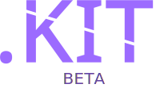

## ABOUT
.KITは[Scratch](https://scratch.mit.edu)でのプロジェクトの拡張性を保つために作成されたライブラリです。

開発は@sei6seiおよび有識者によって進められています。

## how to use
[.NET最新版](https://scratch.mit.edu/projects/1128886666/)へアクセスし、「中を見る」をおして`master`, `dotKit`の二つをバックパックに入れます。

それ以外で現在サポートされているバージョンは以下のとおりです。
| VERSION | SUPPORT |
| ------- | ------- |
|   [BETA](https://scratch.mit.edu/projects/1128886666/)  | ◯ : 短期的なサポート |

## Contribution
プロジェクトをリミックスして公開してください。ただし、過去のバージョン（長期的なサポートは含まない）をリミックス、公開されても対応はできません。
